# GeekVerse G8

O **GeekVerse G8** é uma aplicação web interativa desenvolvida em React para o Trabalho Final de Integração da disciplina de Desenvolvimento Web Front-End. O projeto reúne quatro jogos dinâmicos baseados no universo geek, consumindo APIs públicas de forma totalmente integrada e responsiva.

---

## Sumário

- [Descrição do Projeto](#descrição-do-projeto)
- [Tipo de Aplicação](#tipo-de-aplicação)
- [Tema Escolhido](#tema-escolhido)
- [Objetivo do Sistema](#objetivo-do-sistema)
- [Integrantes](#integrantes)
- [Jogos Desenvolvidos](#jogos-desenvolvidos)
- [Funcionalidades Principais](#funcionalidades-principais)
- [APIs Utilizadas](#apis-utilizadas)
- [Tecnologias Utilizadas](#tecnologias-utilizadas)
- [Como Funciona o Ranking e a Auditoria](#como-funciona-o-ranking-e-a-auditoria)
- [Como Funciona o Envio por E-mail](#como-funciona-o-envio-por-e-mail)
- [Pré-requisitos](#pré-requisitos)
- [Como Executar o Projeto](#como-executar-o-projeto)
- [Configuração do Ambiente](#configuração-do-ambiente)
- [Acesso ao Sistema](#acesso-ao-sistema)
- [Estrutura Geral do Projeto](#estrutura-geral-do-projeto)
- [Rotas Principais](#rotas-principais)
- [Exemplos de JSON Formatado](#exemplos-de-json-formatado)
- [Testes Realizados](#testes-realizados)
- [Créditos e Fontes](#créditos-e-fontes)
- [Demonstração Visual do Sistema](#demonstração-visual-do-sistema)

---

## Descrição do projeto

O GeekVerse G8 reúne quatro jogos interativos com temática geek. Cada jogo usa uma API pública diferente e mostra os dados recebidos de forma visual, além de exibir exemplos de JSON formatado diretamente na interface para fins pedagógicos e de auditoria.

A aplicação também possui controle de autenticação simples (login e logout), rotas protegidas, dashboard dinâmico, ranking competitivo, auditoria de sessão local e remota, formulário de contato integrado com EmailJS, página "Sobre" detalhada e uma página 404 personalizada.

---

## Tipo de aplicação

O GeekVerse G8 foi desenvolvido como uma **SPA (Single Page Application)**, ou seja, uma aplicação de página única.

Mesmo possuindo várias telas internas (Login, Dashboard, Jogos, Ranking, Sobre e Página 404), toda a navegação ocorre de forma fluida dentro da própria aplicação, sem recarregar a página HTML a cada troca de tela. As rotas foram organizadas utilizando a biblioteca **React Router DOM**.

---

## Tema escolhido

**Jogos interativos com APIs do universo geek.**

Escolhemos esse tema por sua flexibilidade e por permitir aplicar, em um único projeto prático, diversos conteúdos trabalhados na disciplina:
- Consumo e tratamento de respostas de APIs RESTful.
- Modularização em componentes reutilizáveis.
- Gerenciamento avançado de estados e efeitos (`useState`, `useEffect`, `useContext`, custom hooks).
- Controle de eventos, loaders e fluxos assíncronos.
- Exibição estruturada de dados brutos (JSON formatado).
- Integração com serviços externos de backend-as-a-service e envio de e-mails.

---

## Objetivo do sistema

O objetivo principal é apresentar uma aplicação web interativa, altamente organizada e funcional, demonstrando boas práticas de desenvolvimento front-end com React. 

Além do entretenimento dos jogos, o projeto serve como vitrine técnica para o uso de autenticação, rotas privadas, persistência em banco de dados na nuvem (Supabase), integração com serviços de comunicação (EmailJS) e arquitetura modular de software.

---

## Integrantes

* **Ítalo Dias Moreira Campos**
* **Julyanne Lauriano Genevain**
* **Rakel Garcia da Silva**
* **Raphaell Reiff Galoni**

---

## Jogos Desenvolvidos

### Memórias dos Bruxos
* **API Utilizada**: Harry Potter API.
* **Descrição**: Jogo da memória temático. O usuário escolhe a dificuldade (Fácil, Médio ou Difícil), encontra os pares de personagens e pode registrar sua pontuação no ranking. O jogo trabalha com controle de cartas viradas, contagem de tentativas, cronômetro ativo, feedback visual imediato e exibição do JSON correspondente aos personagens carregados.

### Show do Multiverso
* **API Utilizada**: Rick and Morty API.
* **Descrição**: Quiz dinâmico de perguntas e respostas sobre o universo de Rick and Morty. O jogador responde questões geradas a partir de dados da API, conta com opções de dicas que facilitam a resposta e acumula pontos. Permite visualizar os detalhes do personagem atual da pergunta em formato JSON e registrar o resultado no Hall dos Campeões.

### PokéSombra
* **API Utilizada**: PokéAPI.
* **Descrição**: Jogo clássico de adivinhação do Pokémon. O objetivo é identificar o Pokémon correto usando sua silhueta escurecida, dicas adicionais (como tipo ou habilidades) e informações textuais. Trabalha com carregamento dinâmico de dados, validação de resposta em tempo real, controle de erros de API, cronômetro decrescente e pontuação.

### Fuga do Hiperespaço
* **API Utilizada**: SWAPI (Star Wars API).
* **Descrição**: Jogo de sobrevivência e reflexos no hiperespaço. O usuário monta sua missão escolhendo a nave, o piloto, o planeta de destino, equipamentos e a dificuldade. Durante o jogo, controla a nave no espaço para desviar de obstáculos e coletar cristais. Possui contagem regressiva, HUD detalhado, incremento de dificuldade progressivo, ranking e suporte experimental a controle (gamepad).

---

## Funcionalidades Principais

- **Autenticação**: Tela de login com validação de credenciais, redirecionamento automático pós-login e encerramento seguro de sessão (logout).
- **Segurança de Rotas**: Proteção de rotas internas (privadas) contra acessos não autorizados.
- **Dashboard Central**: Página inicial dinâmica para seleção rápida e estatísticas de acesso dos jogos.
- **Integração de APIs**: Consumo dinâmico de quatro APIs com tratamento robusto de erros de rede e ausência de dados.
- **Exibição de JSON**: Componentes interativos para visualização dos dados brutos retornados pelas APIs, auxiliando no aprendizado de sua estrutura.
- **Feedback e Loading**: Uso de Spinners e loaders elegantes para transições de carregamento de dados.
- **Persistência de Dados**: Salvamento e consulta em tempo real de scores e registros de ranking por meio do Supabase.
- **Auditoria de Sessão**: Rastreamento local das ações do usuário durante a navegação e disparo de logs por e-mail no final da sessão.
- **Página Sobre**: Seção informativa com biografia dos integrantes, descrição técnica do projeto e histórico local de auditoria da sessão ativa.
- **Formulário de Contato**: Envio de mensagens de suporte integradas diretamente com o EmailJS.
- **Navegação Inteligente**: Página 404 customizada para rotas inexistentes.
- **Imersão Visual**: Suporte a modo Fullscreen para focar o jogador na experiência de jogo.
- **Acessibilidade de Controle**: Suporte experimental a gamepad na Fuga do Hiperespaço.

---

## APIs Utilizadas

Cada jogo consome uma API pública específica. A seguir estão os links e documentações de referência:

- **Harry Potter API**: [hp-api.onrender.com](https://hp-api.onrender.com/)
- **Rick and Morty API**: [rickandmortyapi.com](https://rickandmortyapi.com/)
- **PokéAPI**: [pokeapi.co](https://pokeapi.co/)
- **SWAPI**: [swapi.tech](https://swapi.tech/)

---

## Tecnologias Utilizadas

A stack principal do projeto inclui:

- **Core**: [React](https://react.dev/) + [Vite](https://vitejs.dev/) + JavaScript (ES6+)
- **Estilização**: CSS Vanilla (customizado para cada componente, garantindo flexibilidade total e visual responsivo)
- **Roteamento**: [React Router DOM](https://reactrouter.com/) (v6)
- **Persistência & Backend**: [Supabase](https://supabase.com/) (Client-side integration)
- **Comunicação**: [EmailJS](https://www.emailjs.com/) (Envio de contatos, logs de auditoria e exportação de resultados)
- **Pacotes Adicionais**:
  - [React Icons](https://react-icons.github.io/react-icons/) (Ícones modernos e leves)
  - [React Spinners](https://www.davidhu.io/react-spinners/) (Indicadores visuais de carregamento)
- **Versionamento & Deploy**: Git, GitLab e [Vercel](https://vercel.com/)

---

## Como Funciona o Ranking e a Auditoria

### O Ranking
Os resultados de cada partida finalizada com sucesso são enviados para o banco de dados do **Supabase**. O sistema armazena informações como:
- Identificação do jogo
- Nome do jogador
- Dificuldade escolhida
- Pontuação acumulada
- Tempo decorrido
- Estatísticas detalhadas (tentativas, desvios, erros, etc.)

A tabela de classificação consulta essas informações e exibe os rankings ordenados conforme as regras de cada minijogo.

### A Auditoria
Para fins de validação e rastreamento das funcionalidades obrigatórias da disciplina:
1. Eventos críticos (como login, logout, início de partidas, visualização de JSON e exportação de dados) são registrados localmente em memória.
2. A página **Sobre** disponibiliza uma interface para inspecionar os eventos gerados na sessão atual.
3. Ao fim da navegação ou mediante ações específicas, um resumo formatado desses logs de auditoria pode ser enviado ao e-mail dos administradores/integrantes por meio do EmailJS.

> [!WARNING]
> As credenciais de produção do Supabase e do EmailJS estão protegidas por variáveis de ambiente e não devem ser escritas de forma estática no código ou no repositório público.

---

## Como Funciona o Envio por E-mail

O fluxo de comunicação utiliza o serviço **EmailJS**, estruturado em três frentes:
1. **Formulário de Contato**: Envia a mensagem inserida pelo visitante diretamente para a caixa de correio do projeto.
2. **Exportação de Resultados**: Permite ao usuário enviar uma cópia em formato de recibo com sua pontuação de jogo ou o ranking de uma categoria para seu próprio endereço de e-mail.
3. **Logs de Auditoria**: Envia relatórios das interações realizadas durante a execução da aplicação para monitoramento.

---

## Pré-requisitos

Para rodar o projeto localmente, certifique-se de possuir instalado em sua máquina:
- [Node.js](https://nodejs.org/) (versão LTS recomendada)
- Gerenciador de pacotes `npm` (geralmente instalado junto ao Node.js)

---

## Como Executar o Projeto

1. Clone ou baixe este repositório em sua máquina:
   ```bash
   git clone https://gitlab.com/aula-dfe/g8-tf-geekversce.git
   ```

2. Acesse a pasta do projeto:
   ```bash
   cd g8-tf-geekversce
   ```


3. Instale todas as dependências necessárias:
   ```bash
   npm install
   ```

4. Crie o arquivo de variáveis de ambiente a partir do modelo disponibilizado:
   ```bash
   cp .env.example .env
   ```
   *(No Windows, você também pode criar um arquivo chamado `.env` manualmente na raiz do projeto e colar os campos listados no `.env.example`).*

5. Inicie o servidor de desenvolvimento local do Vite:
   ```bash
   npm run dev
   ```

6. Abra o link gerado no seu navegador:
   ```text
   http://localhost:5173/
   ```
   *(Caso a porta 5173 esteja ocupada, o Vite utilizará outra automaticamente. Fique atento às instruções exibidas no terminal).*

---

## Configuração do Ambiente

O correto funcionamento das integrações com o Supabase e EmailJS depende das variáveis de ambiente criadas no arquivo `.env`. Preencha as chaves no arquivo com os valores fornecidos pelo seu painel de administração dos respectivos serviços:

```env
VITE_SUPABASE_URL=seu_url_do_supabase
VITE_SUPABASE_ANON_KEY=sua_chave_anonima_do_supabase
VITE_EMAILJS_SERVICE_ID=seu_service_id_principal
VITE_EMAILJS_TEMPLATE_CONTATO=seu_template_de_contato
VITE_EMAILJS_TEMPLATE_EXPORTACAO=seu_template_de_exportacao
VITE_EMAILJS_PUBLIC_KEY=sua_chave_publica_do_emailjs
VITE_EMAILJS_TEMPLATE_GAME_RESULT=seu_template_de_resultado
VITE_EMAILJS_RANKING_SERVICE_ID=seu_service_id_para_ranking
VITE_EMAILJS_TEMPLATE_RANKING=seu_template_de_ranking
VITE_EMAILJS_RANKING_PUBLIC_KEY=sua_chave_publica_de_ranking
VITE_EMAILJS_TEMPLATE_AUDIT=seu_template_de_auditoria
```

---

## Acesso ao Sistema

A tela de login é a porta de entrada para a aplicação. Após inserir as credenciais, o usuário é autenticado e redirecionado automaticamente para o **Dashboard**. Caso tente acessar alguma URL interna diretamente sem estar logado, as rotas protegidas o redirecionarão de volta para a tela de autenticação.

---

## Estrutura Geral do Projeto

Abaixo está o mapeamento dos principais diretórios da aplicação:

```text
src/
├── assets/         # Recursos estáticos (imagens, fundos de tela, arquivos de áudio)
├── components/     # Componentes visuais globais e modulares reutilizáveis
├── contexts/       # Contextos globais (como autenticação, auditoria e estado geral)
├── data/           # Configurações estáticas, catálogos de rotas e dados de jogos
├── experimental/   # Recursos sob teste (ex: suporte a controle gamepad)
├── hooks/          # Custom hooks contendo a lógica dos jogos e utilitários
├── pages/          # Páginas e views completas da SPA (Dashboard, Jogos, Login, Sobre, etc.)
├── services/       # Integrações de rede (Supabase client, chamadas de APIs e EmailJS)
├── styles/         # Arquivos de estilização e variáveis CSS globais
├── utils/          # Helpers, formatadores e validadores de dados genéricos
├── App.jsx         # Componente raiz contendo rotas e providers da aplicação
└── main.jsx        # Ponto de entrada do React
```

---

## Rotas Principais

- `/login` : Tela inicial para autenticação de usuários.
- `/app` : Dashboard principal com acesso aos cards dos jogos.
- `/app/harry-potter` : Jogo *Memórias dos Bruxos*.
- `/app/rick-morty` : Jogo *Show do Multiverso*.
- `/app/pokemon` : Jogo *PokéSombra*.
- `/app/star-wars` : Jogo *Fuga do Hiperespaço*.
- `/app/ranking` : Tela geral para visualização de campeões.
- `/app/ranking/:gameId` : Classificação detalhada filtrada por jogo.
- `/app/sobre` : Tela informativa e painel de logs da auditoria local.
- `*` : Rota de fallback para renderização da página 404 personalizada.

---

## Exemplos de JSON Formatado

Abaixo constam exemplos da estrutura dos dados brutos retornados pelas respectivas APIs durante as partidas:

### Harry Potter API
```json
{
  "name": "Harry Potter",
  "house": "Gryffindor",
  "wizard": true
}
```

### Rick and Morty API
```json
{
  "name": "Rick Sanchez",
  "status": "Alive",
  "species": "Human"
}
```

### PokéAPI
```json
{
  "name": "pikachu",
  "types": ["electric"],
  "base_experience": 112
}
```

### SWAPI
```json
{
  "name": "Tatooine",
  "climate": "arid",
  "terrain": "desert"
}
```

---

## Testes Realizados

Durante a fase de homologação, os seguintes fluxos essenciais foram testados e validados:
- Validação e mensagens de erro na autenticação com credenciais incorretas.
- Navegação fluida sem reloads através do roteador SPA.
- Comportamento e redirecionamento automático de rotas protegidas (guardas de rotas).
- Requisições assíncronas concorrentes nas quatro APIs geek.
- Tratamento gracioso de lentidão e quedas de conexão com loaders e placeholders de erro.
- Persistência, ordenação correta e paginação de dados do ranking no Supabase.
- Envio de e-mails com layouts formatados via EmailJS (contatos, resultados e auditoria).
- Rastreamento e exibição local dos eventos da auditoria de sessão.
- Interatividade e responsividade do layout em diferentes resoluções (Desktop, Tablet, Mobile).
- Suporte ao modo Fullscreen nos minijogos.
- Build de produção finalizado com sucesso sem erros de transpilação.

---

## Créditos e Fontes

Agradecimentos aos serviços e documentações públicas que viabilizaram o projeto:
- [React Documentation](https://react.dev/)
- [Harry Potter API](https://hp-api.onrender.com/)
- [Rick and Morty API](https://rickandmortyapi.com/)
- [PokéAPI](https://pokeapi.co/)
- [SWAPI](https://swapi.tech/)
- [Supabase API Reference](https://supabase.com/docs)
- [EmailJS Documentation](https://www.emailjs.com/docs/)

---

## Demonstração Visual do Sistema

Os prints abaixo apresentam os principais fluxos do GeekVerse G8 em funcionamento. Cada tela demonstra, na prática, conceitos trabalhados na disciplina de Desenvolvimento Web Front End.

### 1. Login e autenticação
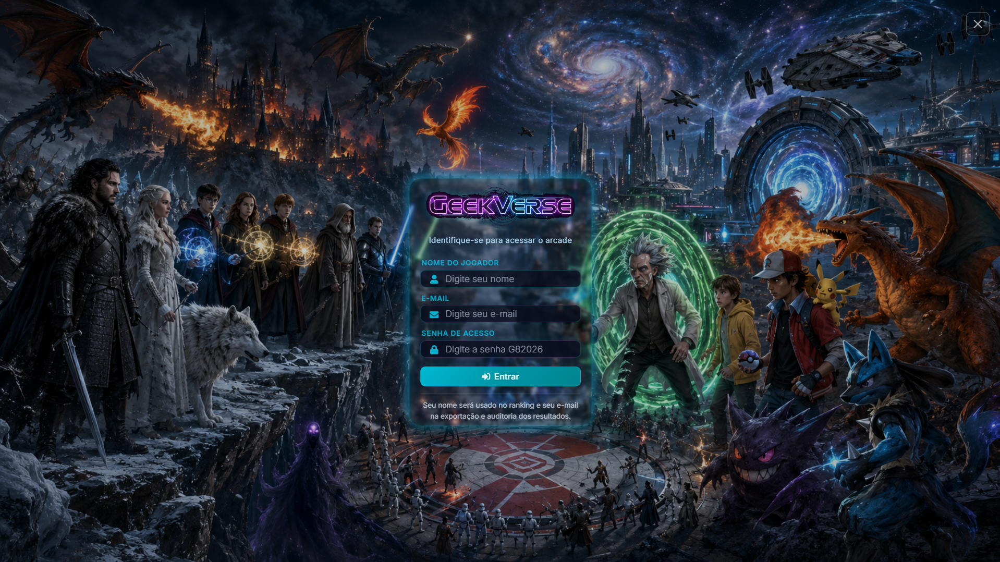
*A tela de login é a entrada do usuário no sistema. Nela, usamos estado para controlar os campos do formulário, evento de envio para validar os dados e navegação para direcionar o jogador ao dashboard após a autenticação.*

### 2. Dashboard principal
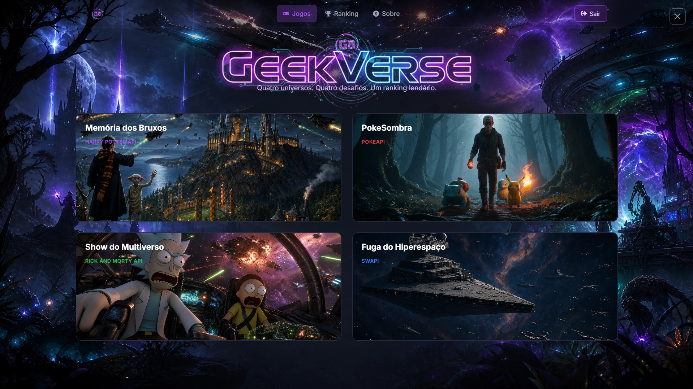
*O dashboard funciona como a tela central da aplicação. Ele organiza os jogos em cards e permite a navegação interna entre os módulos do sistema, mantendo a proposta de uma SPA desenvolvida em React.*

### 3. Memória dos Bruxos
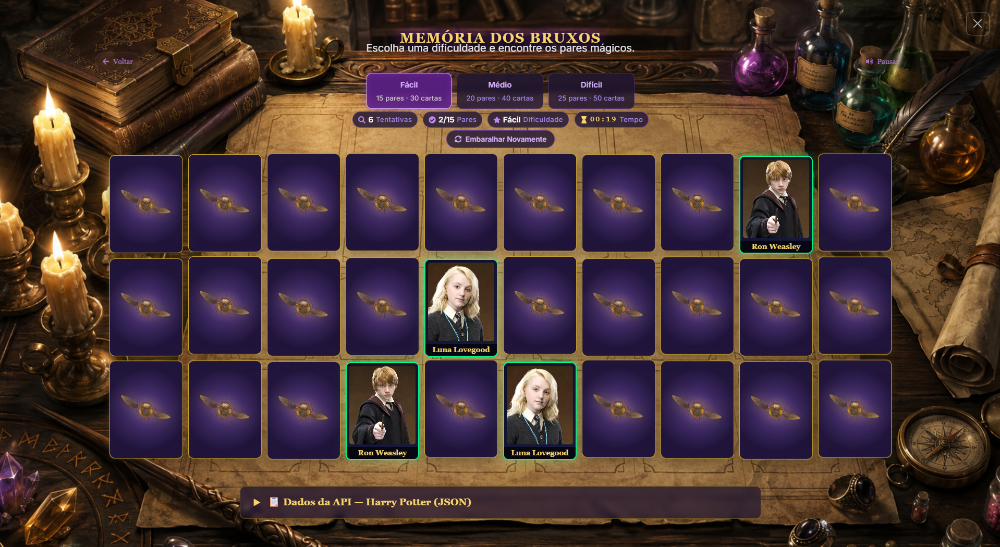
*No jogo Memória dos Bruxos, usamos estado para controlar cartas viradas, pares encontrados, tentativas, tempo e status da partida. A interação acontece por eventos de clique, e a interface é atualizada conforme o progresso do jogador.*

### 4. PokéSombra: seleção de dificuldade
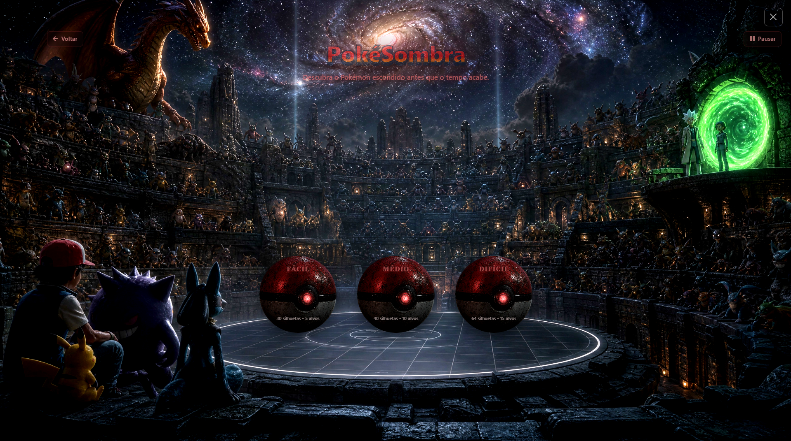
*Nesta tela, o jogador escolhe a dificuldade antes de iniciar a partida. Esse fluxo demonstra o uso de estado para armazenar a opção selecionada e renderização condicional para preparar o desafio conforme o nível escolhido.*

### 5. PokéSombra: partida
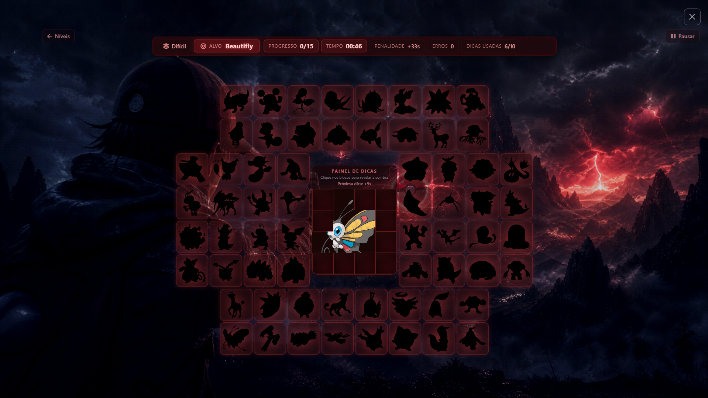
*Durante a partida do PokéSombra, o sistema utiliza dados da PokéAPI para montar o desafio. A tela controla Pokémon atual, dicas, respostas, erros, acertos e tempo, mostrando a integração entre API externa e estado em React.*

### 6. PokéSombra: resultado
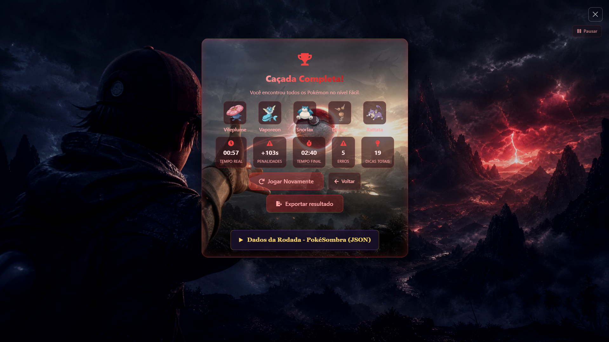
*A tela de resultado mostra a finalização da partida e o desempenho do jogador. Esse fluxo demonstra cálculo de resultado, feedback visual, controle do status do jogo, integração com ranking e possibilidade de exportação.*

### 7. Show do Multiverso: início
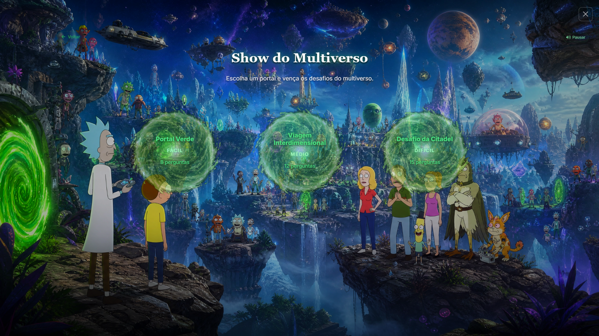
*No início do Show do Multiverso, o jogador escolhe o modo de jogo. A tela demonstra navegação interna, seleção de dificuldade e preparação da partida com componentes reutilizáveis e controle de estado.*

### 8. Show do Multiverso: partida
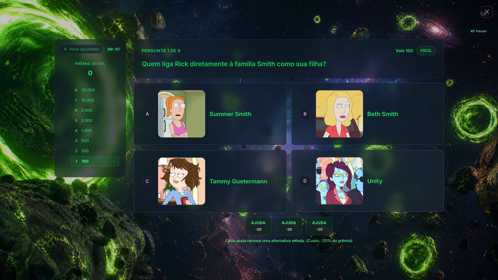
*Durante a partida, usamos estado para controlar pergunta atual, alternativas, pontuação, dicas e progresso. As respostas são processadas por eventos de clique, atualizando a interface de forma dinâmica.*

### 9. Show do Multiverso: resultado
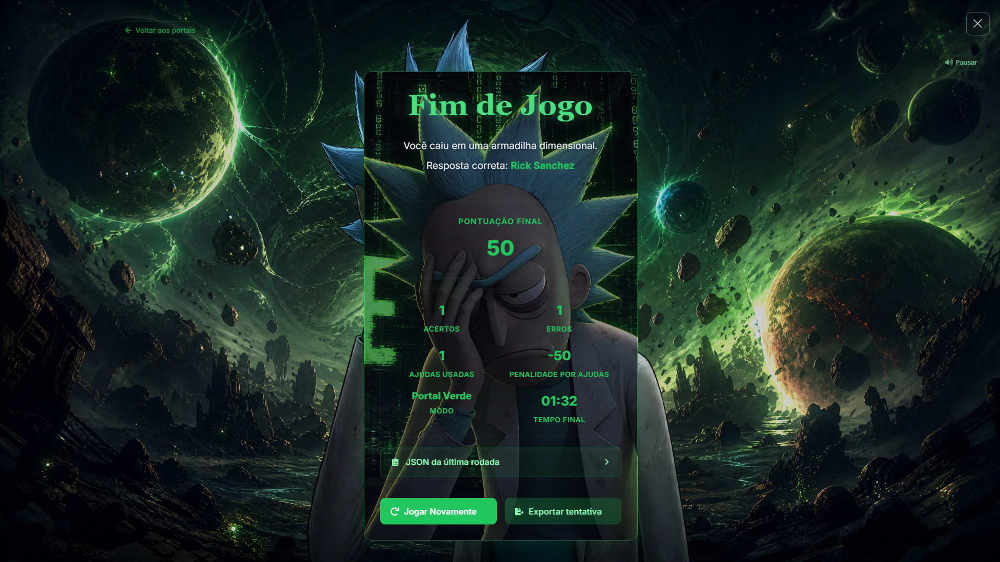
*A tela de resultado demonstra o tratamento do fim da partida, seja em caso de vitória ou derrota. Esse print mostra feedback ao usuário, renderização condicional e controle do estado final do jogo.*

### 10. Fuga do Hiperespaço: seleção
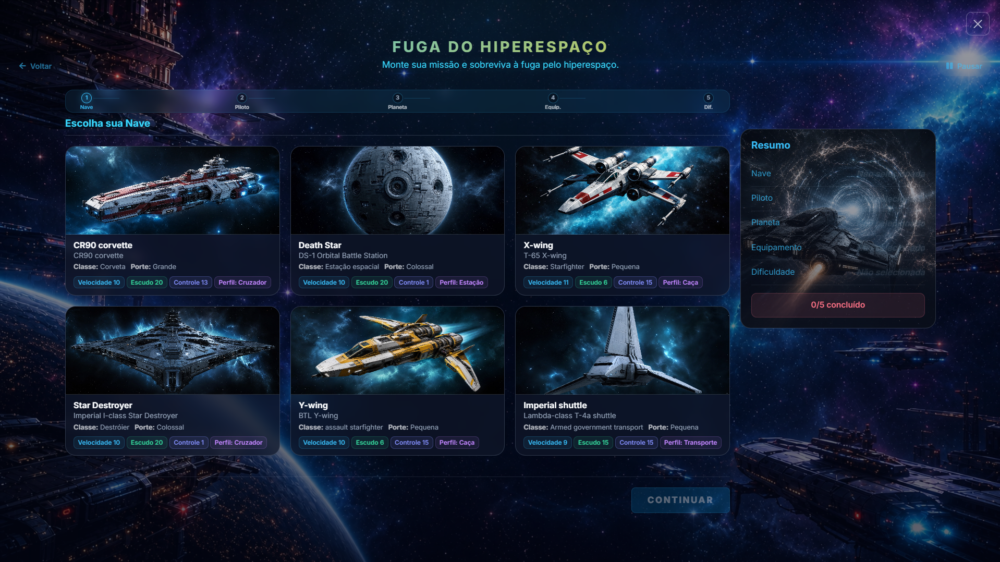
*Na Fuga do Hiperespaço, usamos um fluxo por etapas para montar a missão. O jogador escolhe nave, piloto, planeta, equipamento e dificuldade, e cada escolha altera os dados usados na próxima etapa.*

### 11. Fuga do Hiperespaço: relatório da missão
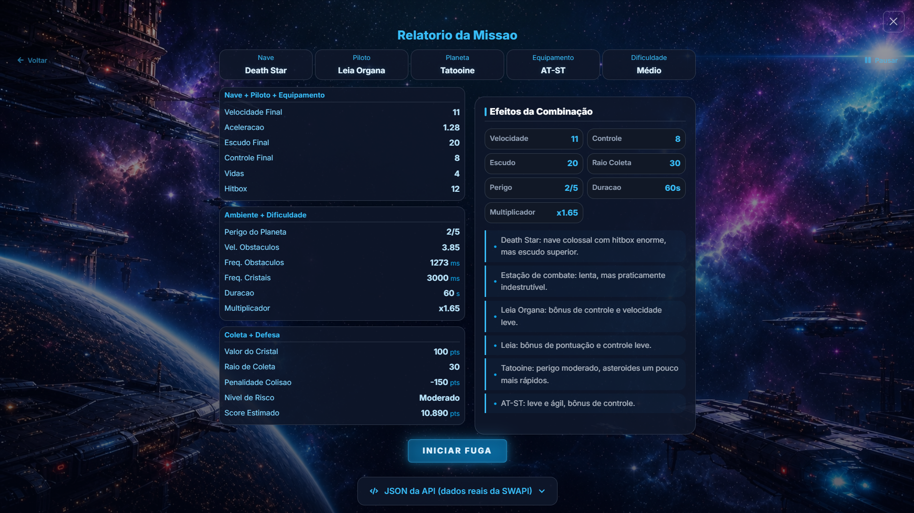
*O relatório da missão reúne dinamicamente as escolhas feitas pelo jogador. Ele apresenta atributos, efeitos da combinação, dificuldade e dados usados para preparar a partida antes do início da fuga.*

### 12. Fuga do Hiperespaço: partida
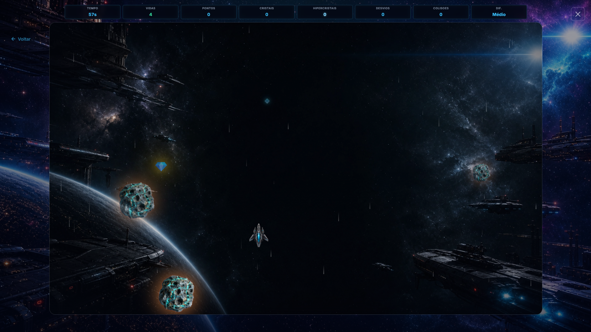
*Durante a partida, a tela apresenta HUD com tempo, vidas, pontuação, cristais, desvios, colisões e dificuldade. Esse fluxo mostra atualização visual em tempo real, eventos de controle e lógica de jogo baseada no estado da missão.*

### 13. Hall dos Campeões
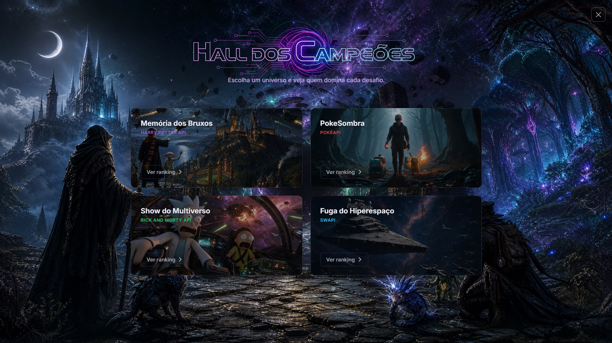
*O Hall dos Campeões centraliza o acesso aos rankings dos jogos. A tela usa cards para organizar os universos e permite consultar os resultados de cada desafio de forma visual e direta.*

### 14. Ranking com dados
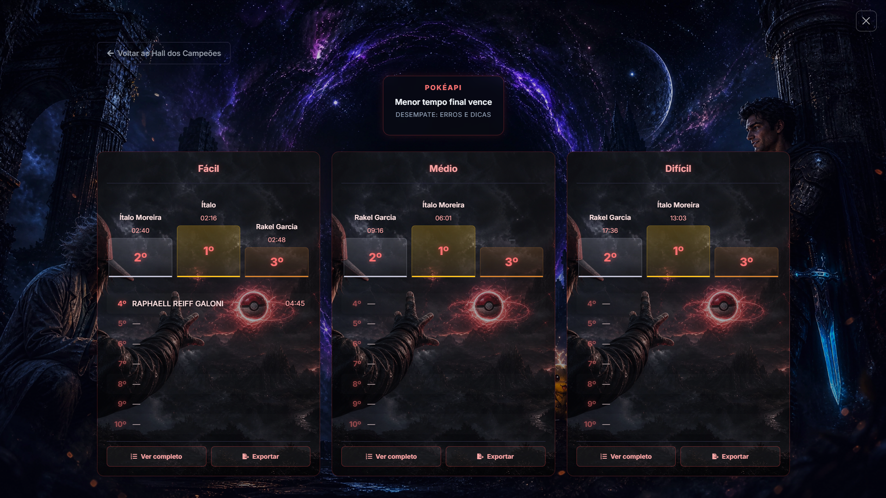
*Nesta tela, o ranking apresenta dados de desempenho dos jogadores separados por dificuldade. O sistema compara resultados usando critérios como tempo, erros, dicas ou pontuação, de acordo com a regra de cada jogo.*

### 15. Ranking detalhado
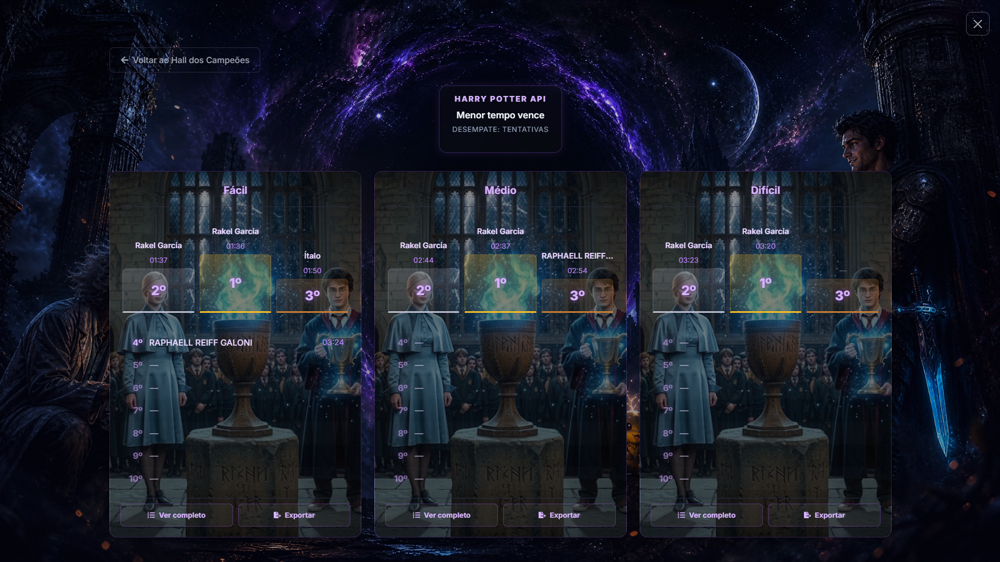
*O ranking detalhado reforça a organização dos resultados e a comparação entre jogadores. Também mostra a opção de exportação, conectando os dados do ranking ao fluxo de envio por e-mail.*

### 16. Página Sobre
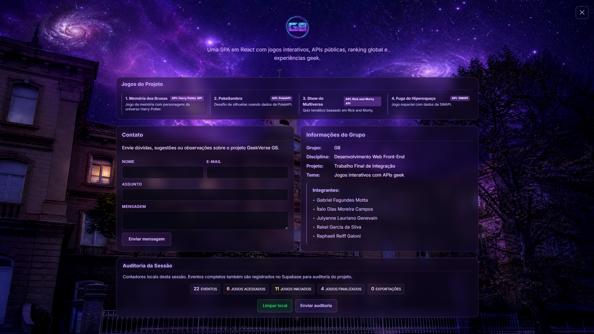
*A página Sobre apresenta a proposta do GeekVerse G8, as tecnologias utilizadas e os principais recursos do sistema. Ela funciona como uma documentação visual do projeto dentro da própria aplicação.*

### 17. E-mail de resultado da partida
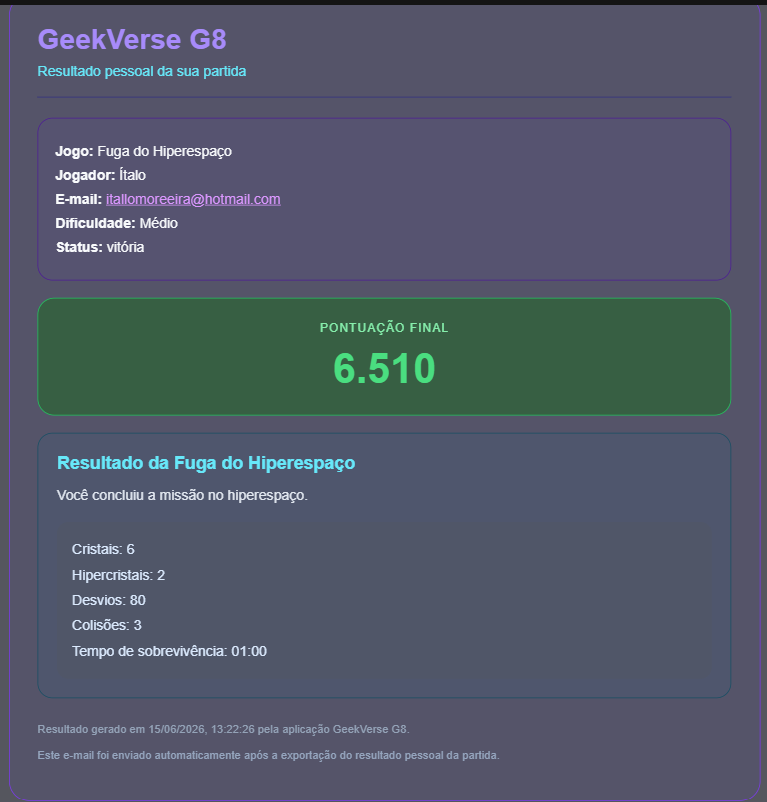
*Este print comprova a integração com EmailJS para envio do resultado pessoal da partida. O e-mail apresenta informações como jogo, jogador, dificuldade, status, pontuação e resumo do desempenho.*

### 18. E-mail de ranking
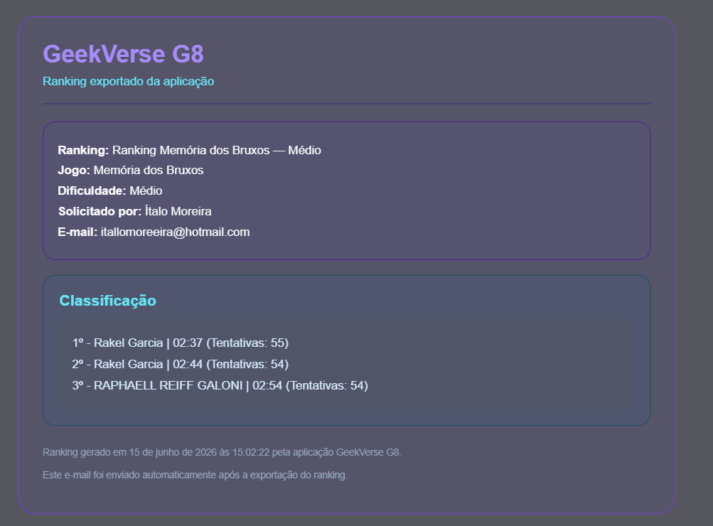
*O e-mail de ranking demonstra a exportação dos dados classificados. Esse recurso conecta o ranking da aplicação ao serviço de e-mail, permitindo compartilhar os resultados gerados pelo sistema.*

### 19. E-mail do formulário de contato
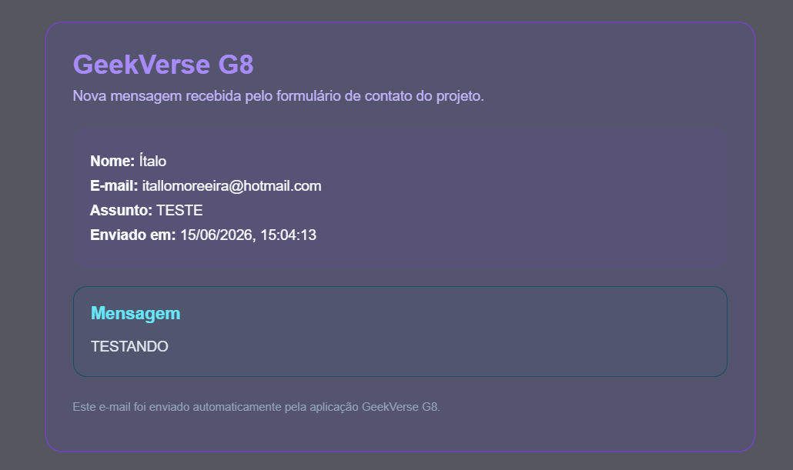
*O formulário de contato utiliza campos controlados, evento de envio e integração com EmailJS. Esse fluxo permite que uma mensagem enviada pela interface seja encaminhada ao e-mail do projeto.*

### 20. E-mail de auditoria
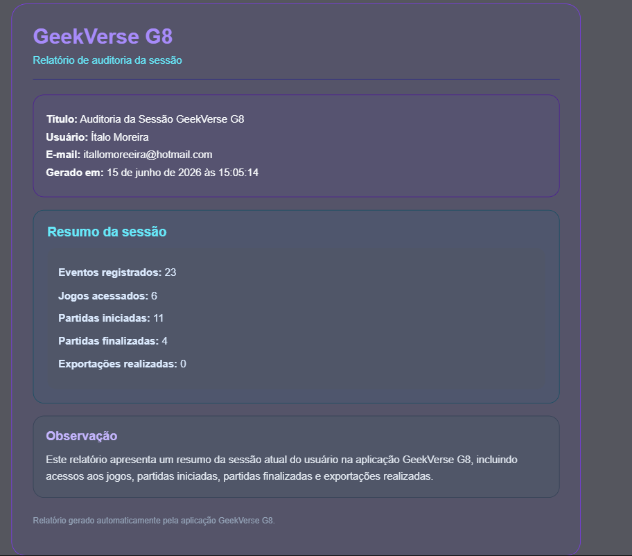
*O e-mail de auditoria registra eventos importantes da sessão, como login, acesso aos jogos, partidas iniciadas, partidas finalizadas e exportações. Esse recurso demonstra o acompanhamento das ações do usuário dentro do sistema.*

